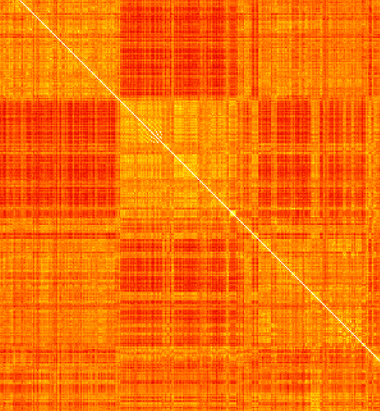

# AutoCruden
To view the results: [AutoCruden](https://autocruden.com)

## TL;DR
A machine learning model tells you which verses of the Bible are most and least similar to each other.

## Limitations
The model (see [making of](#making-of)) has been trained (by far cleverer people than me) on lots of similar and dissimilar sentences. It may not be suited to use with the Bible, and a different model might well give completely different results: The results are therefore neither definitive nor scientific!

# TODO Update Everything Below Here, as we now use Berean Standard Bible rather than World English Bible
Claude 4 was also used to rewrite the code and add lots of new features.

## Bible Map Browser
### Controls
Zoom in and out with the scroll wheel or by pinching on mobile (note that Firefox mobile is much better for this page than Chrome mobile). Double click on a pixel to show which two verses are being compared.

This will also report their similarity on a scale from 1.0 (the same) to a possible -1.0 (completely different, though no verses are this dissimilar). The brighter the colour, the more similar the verses, and of course every verse has a similarity of 1.0 with itself (the diagonal).

### Examples
Notice the bright off-diagonal streaks around the gospels where the parallel passages occur e.g. between Matthew and Mark:

And the measuring of the temple in Ezekiel 40 and how it differs from the material around it:

And the bit of Numbers 7 where the same thing happens 12 times:

The enormous Psalm 119, which again differs from its surroundings, and the repeated refrain in Psalm 136:

And the more complex structure in Ezra-Nehemiah:

Much more interesting things can likely be found further from the diagonal, such as the comparison between Isaiah and Revelation or Chronicles and Kings.

## Verse Explorer
Instead of presenting the findings in visual form, [this tool](http://www.autocruden.com/explorer.html) (which takes a little while to load) will let you find the most similar (or dissimilar) verses to some chosen verse. When it has loaded, try searching for John 3:16 as a starting point.

## Making of
The whole thing is made by embedding every verse of the World English Bible (a fairly recent public domain translation of the Bible which I got from [here](https://biblehub.net/)) as a 768 dimensional vector using a machine learning model, specifically [all-mpnet-base-v2](https://huggingface.co/sentence-transformers/all-mpnet-base-v2) provided by the excellent [Sentence Transformers](https://www.sbert.net/) library. The Bible Map Browser then displays the cosine similarity between these vectors for every possible pair of verses, ranging from 1 (white, see the diagonal) through 255 shades of red all the way to the lowest value (black, which is a number between 0 and -1, the possible minimum of -1 not being attained), using the fire colourmap provided by [Colorcet](https://colorcet.holoviz.org/). The Bible map browser is then a fairly simple webpage built on top of [OpenSeadragon](https://openseadragon.github.io/). In due course I might publish the Colab notebook used to generate the images.

## Todo
In future I might make the verse explorer more powerful by allowing similarity to be computed between any arbitrary sentence input by the user and every verse of the Bible. This would allow fast search of the Bible (and let's be honest, the only really reliable way to find that verse you have in mind at the moment is to Google the bit of it you remember). However, I will need to find a way to export the embedding model to something that can be run in the browser via ONNX, since all the embeddings used in this tool are precomputed using Google Colab.

## Name
The tool is named after Cruden's Concordance, an enormous and painstakingly compiled reference work from 1737 that listed every occurrence of every word in the Bible. That was completed in a year by Alexander Cruden working from 7am to 1am the following day. The same task can happily now be performed on the fly by your smartphone for any word you are interested in.

## Learn more
Whilst it is a nice way to get an overview of the Bible, if you really want to read it properly you are best off looking at [BibleGateway](https://www.biblegateway.com/) on desktop or [YouVersion](https://www.youversion.com/the-bible-app/) on mobile, or a hard copy (I'd suggest the New International Version (NIV) rather than the World English Bible, as it's much more widely used and readily available, and I like the way it reads more). If you want to read it in a year you need to read between 4 and 5 chapters (most are short) per day. Don't (only) start at the begining, anymore than you would insist on studying stone age history before starting on iron age history, or borrowing library books only by people with surnames starting with A.
